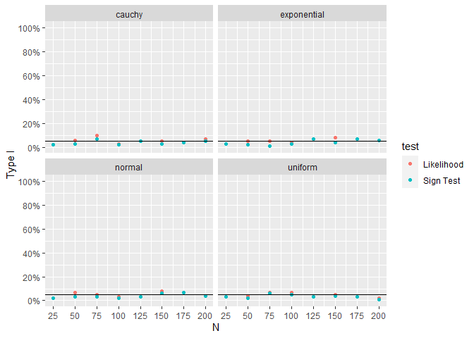
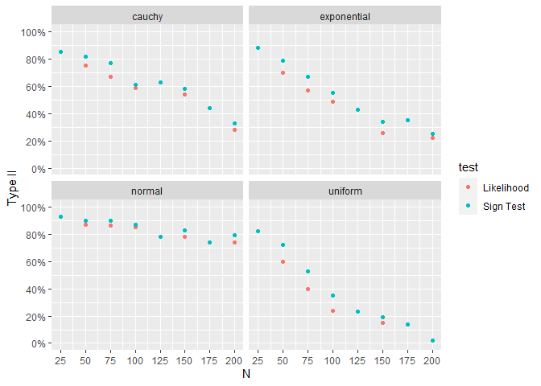

## Which nonparametric test for the median is best?

There are two nonparametric tests for the median. Which test is best? Is
one test better in some situations and the other test better in another
situation? This repo compares the two hypothesis tests with data from
four different distributions.

Tests:

- Empirical Likelihood
- Sign Test

Distributions:

- Gaussian
- Cauchy
- Uniform
- Exponential

The main outcome is type I error is the basically the same for both
tests. Type II error is slightly lower for the empirical likelihood
test.

## Experimental Design

In this experiment, two settings vary. N goes from 25 to 200 increasing
by 25. The distribution changes between normal, cauchy, uniform and
exponential. Each combination is repeated 100 times. Per row, the two
test receive the exact same data and have the exact same null
hypothesis.

The first few simulations look like

    # A tibble: 3,200 × 5
       dist       n iteration   LR_P   S_P
       <chr>  <dbl>     <int>  <dbl> <dbl>
     1 cauchy    25         1 0.842  1    
     2 cauchy    25         2 0.548  0.69 
     3 cauchy    25         3 0.0687 0.108
     4 cauchy    25         4 0.842  1    
     5 cauchy    25         5 0.548  0.69 
     6 cauchy    25         6 0.316  0.424
     7 cauchy    25         7 0.548  0.69 
     8 cauchy    25         8 0.0687 0.108
     9 cauchy    25         9 0.842  1    
    10 cauchy    25        10 0.159  0.230
    # ℹ 3,190 more rows

## Type I Error

Each combination of N and distribution is aggregated to calculate type I
error.

For all four distributions, type I error is essentially the same.

## Type II Error

For type II error, the simulation is repeated. The major change is the
null hypothesis is false. Each combination of N and distribution is
aggregated to calculate type II error. Note the effect size is only .25.

Type II error is slightly lower for the empirical test for all four
distributions.

